# P-Cal 📅

Una semplice e moderna applicazione web di calendario personale, con gestione avanzata degli eventi e reminders programmabili, con un sistema di notifiche multi-canale.

**P-Cal** (Private Calendar) è pensato come un utile calendario self-hostable, moderno e multi-utente, destinato a privati o piccole aziende che vogliono avere il **pieno controllo dei propri dati**.

Il software è **libero e orientato alla privacy**: completamente privo di tracker o raccolta dati, può essere installato sui tuoi server per garantire massima riservatezza. Trattandosi di un progetto personale, il mantenimento e l'implementazione di nuove funzionalità dipenderà dal tempo libero a disposizione. 🙂

## ✨ Funzionalità Principali

### 📊 **Gestione Calendario Completa**
- **Viste multiple**: Mese, Settimana, Giorno e Agenda
- **Gestione eventi/attività** con colori personalizzabili, luogo e descrizioni
- **Visualizzazione temporale intelligente** con distinzione eventi passati/futuri
- **Griglia oraria precisa** nella vista settimana con indicatori visivi per attività fuori schermo
- **Tooltips informativi**

### ⏰ **Sistema di Reminder Avanzato**
- **Notifiche multi-canale**: attualmente implementati Email e NTFY server
- **Reminder multipli** per ogni attività
- **Scheduling flessibile** (minuti, ore, giorni prima dell'evento)
- **Gestione automatica** delle notifiche scadute

### 👤 **Gestione Utente e Preferenze**
- **Registrazione e login**
- **Profilo utente** basic info
- **Sezione sicurezza** per modifica password e abilitazione 2FA
- **Export dati completo** (GDPR-friendly)
- **Eliminazione account** con cancellazione dati

### ⚙️ **Preferenze** (per utente):
  - **Tema** (chiaro/scuro/automatico)
  - **Fuso orario** (necessario per corretto invio di notifiche)
  - **Formato orario** (12h/24h)
  - **Primo giorno della settimana** (Lunedì/Domenica)
  - **Abilitazione/disabilita notifiche** per tipologia
  - **Modifica del Topic NTFY personale**

### 🎨 **Esperienza Utente**
- **Design responsivo** ottimizzato per desktop e mobile
- **Interfaccia moderna** con Tailwind CSS
- **Tema adattivo** al sistema operativo
- **Performance ottimizzate** con lazy loading
- **Eventi passati** collassabili nelle viste giorno/agenda

### 🔐 Sicurezza
- **Password hashing** con BCrypt (strength 12)
- **JWT tokens** con scadenza configurabile
- **Input validation** completa lato server
- **CORS protection** configurabile
- **Two-Factor Authentication** TOTP
- **Secure password reset** via email temporizzato
- **Data isolation** per utente a livello di API

## 📸 Screenshots

### Desktop
<p>
    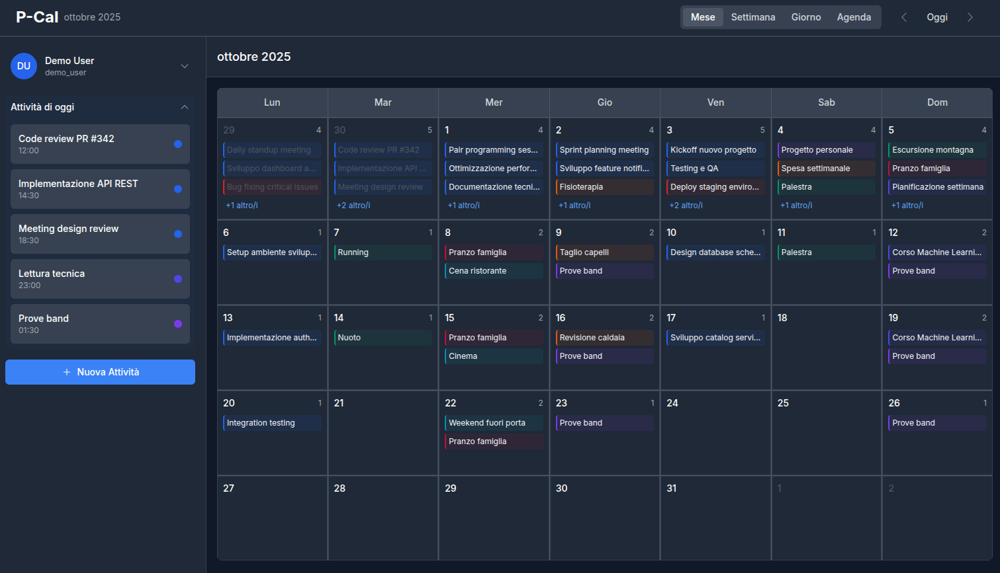
    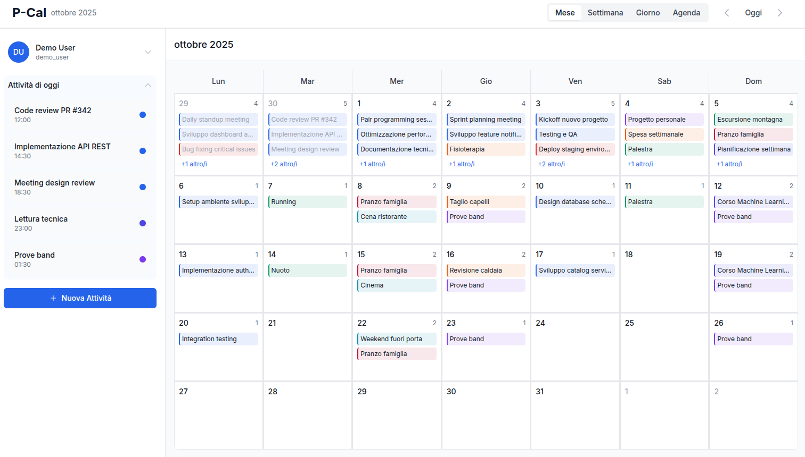
    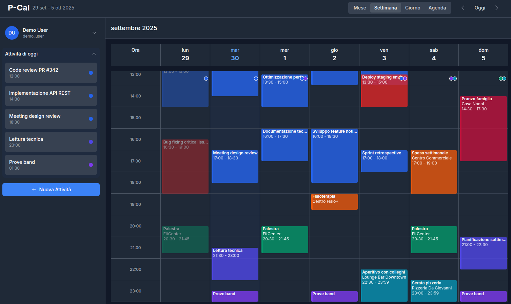
    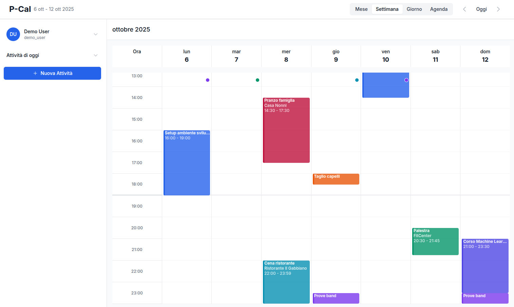
    
    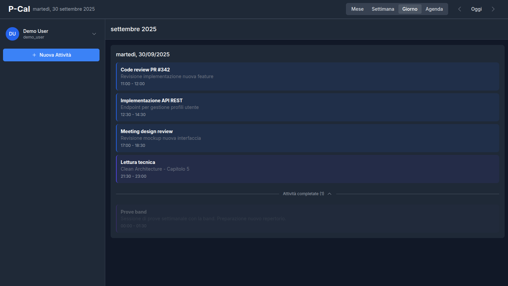
    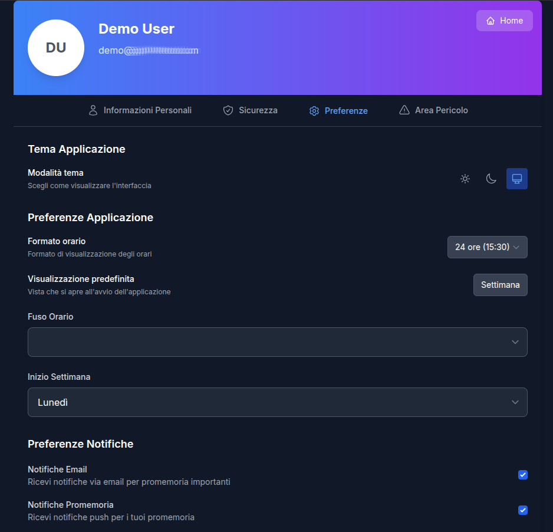
    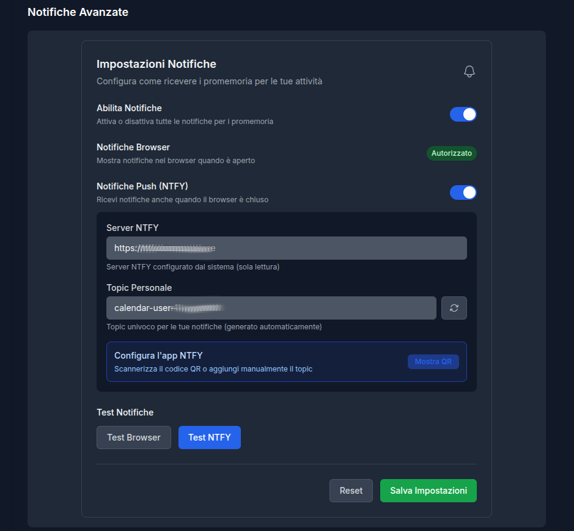
    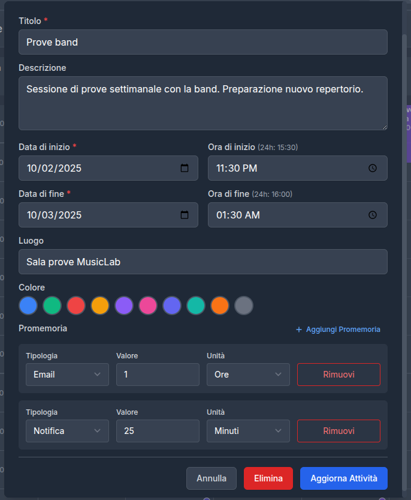
    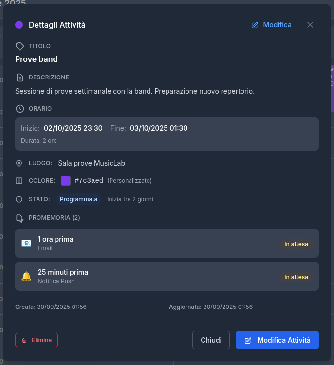
</p>

### Phone
<p>
   
   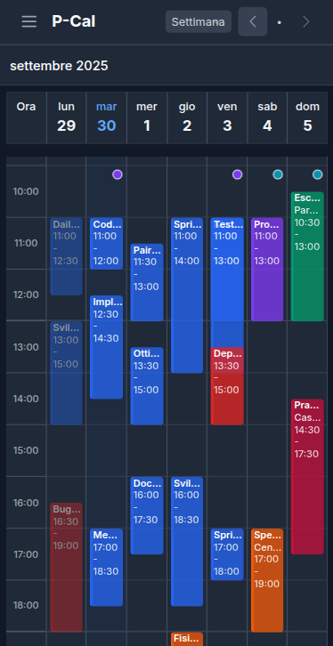
   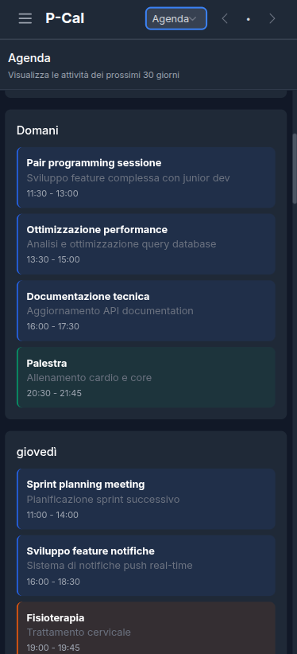
   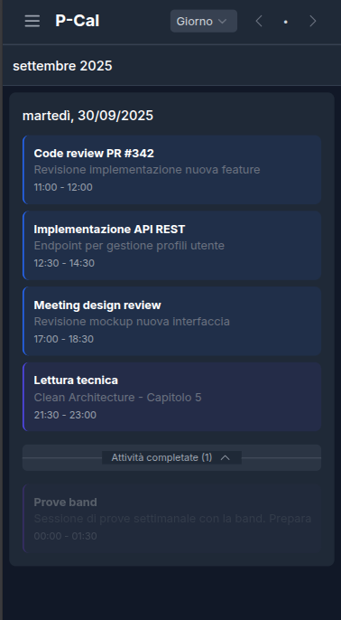
   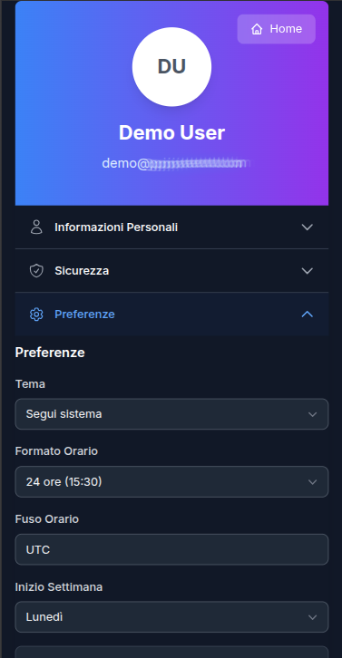
   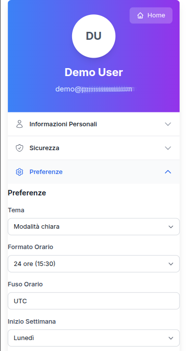
</p>


## 🐳 Deploy con Docker/Podman-Compose (consigliato)
```bash
# Production build
docker-compose -f docker-compose.prod.yml up -d

# Con SSL/HTTPS
docker-compose -f docker-compose.prod.yml -f docker-compose.ssl.yml up -d
```


## 🏗️ Architettura

### Frontend
- **Vue.js 3** - Composition API, Pinia per gestione store e stato applicativo
- **TypeScript** per type safety
- **Tailwind CSS** per styling moderno
- **Pinia** per state management
- **Vite** per build veloce
- **Vue Router** per navigazione SPA

### Backend
- **Spring Boot 3.2** con Java 17
- **Spring Security** per autenticazione/autorizzazione
- **JPA/Hibernate** per ORM
- **PostgreSQL** come database principale
- **Lombok** per riduzione boilerplate
- **Maven** per gestione dipendenze

### Infrastructure
- **Docker** e **Docker Compose** per containerizzazione e quick deploy
- **PostgreSQL** con script di migrazione automatici
- **Nginx image** come reverse proxy
- **Server NTFY** per notifiche push (esterno al progetto)

## ⚡ Ottimizzazioni
- **Lazy loading** per componenti e route
- **Code splitting** automatico con Vite
- **Tree shaking** per bundle ottimizzati
- **Caching intelligente** degli eventi nello store (Pinia)
- **Database indexing**
- **Connection pooling**
- **Paginazione** per liste di eventi

## 🚀 Quick Start

### Prerequisiti
- Docker/Podman e Docker Compose
- Git

### Installazione

1. **Clona il repository**
   ```bash
   git clone <your-repository-url>
   cd PrivateCal_v2
   ```

2. **Configura l'ambiente**
   ```bash
   cp .env.example .env
   # Modifica .env con le tue configurazioni
   ```

3. **Avvia l'applicazione**
   ```bash
   docker-compose up --build -d
   ```

4. **Accedi all'applicazione**
   - **Frontend**: http://localhost:3000
   - **Backend API**: http://localhost:8080/api
   - **Swagger UI**: http://localhost:8080/swagger-ui.html
   - **Health Check**: http://localhost:8080/actuator/health

## ⚙️ Configurazione

### File .env principale
```bash
# Database PostgreSQL
DATABASE_URL=jdbc:postgresql://database:5432/privatecal_db
DATABASE_USERNAME=privatecal_user
DATABASE_PASSWORD=your_secure_password

# JWT Security
JWT_SECRET=your-super-secret-jwt-key-change-in-production-min-256-bits
JWT_ACCESS_TOKEN_EXPIRATION=86400000
JWT_REFRESH_TOKEN_EXPIRATION=604800000

# Email Configuration (SMTP)
MAIL_HOST=smtp.gmail.com
MAIL_PORT=587
MAIL_USERNAME=your-email@gmail.com
MAIL_PASSWORD=your-app-password
MAIL_FROM=noreply@privatecal.com

# NTFY Notifications
NTFY_SERVER_URL=https://ntfy.sh
NTFY_TOPIC_PREFIX=privatecal-user-
NTFY_AUTH_TOKEN=

# Application
APP_BASE_URL=http://localhost:3000
```

### Configurazione NTFY
P-Cal supporta notifiche tramite [NTFY](https://github.com/binwiederhier/ntfy), un servizio di notifiche push self-hosted, funzionale e di semplice gestione.

**Opzioni di configurazione:**
- E' possibile usare il server pubblico `https://ntfy.sh`
- oppure utilizzare il tuo server NTFY self-hosted **(consigliato)**
- Prevista configurazione per autenticazione utente se il server è privato

**Esempio configurazione:**
```bash
NTFY_SERVER_URL=https://your-ntfy-server.com
NTFY_TOPIC_PREFIX=your-app-prefix-
NTFY_AUTH_TOKEN=your-auth-token  # Opzionale per server privati
```

Per maggiori dettagli: [NTFY Documentation](https://docs.ntfy.sh/)


## 🎯 Roadmap Future

### 🔧 Possibili funzionalità future (in valutazione, senza un ordine preciso)
- **Categorie eventi** con filtro di visualizzazione globale (alternativa a calendari multipli)
- **Eventi ricorrenti** con pattern personalizzabili
- **Gestione multilingua**
- **Drag & Drop** per spostamento evento/attività nelle griglie ed update automatico
- **Gestione avanzata sessioni utente**
- **Canali di notifica aggiuntivi**: Gotify, Slack, Telegram, ...
- **Integrazione CalDAV**
- **Import dati** da export utente
- **Import dati** da altri calendar
- **Condivisione eventi** tra gli utenti (gestione inviti)

### 📱 Possibili espansioni
- **API mobile** per app native
- **Calendario condiviso** multi-utente
- **Plugin system** per integrazioni


## 📄 Licenza

Questo progetto è rilasciato sotto **MIT License**.

```
MIT License - Uso libero per progetti personali e commerciali
Vedi LICENSE file per tutti i dettagli
```

## 📞 Supporto

### Documentazione
- **API docs**: Swagger UI disponibile in`/swagger-ui.html`
- **OpenAPI JSON**: Disponibile su `/v3/api-docs`
- **Code comments**: Javadoc e TSDoc
- **Architecture docs**: Work in progress!

### Reporting Issues
- 🐛 **Bug reports**: Usa issue template
- 💡 **Feature requests**: Discussione prima implementazione


---

**Sviluppato con ❤️ per gestire eventi ed attività da ricordare in modo moderno ed efficace, mantenendo il pieno controllo dei propri dati**