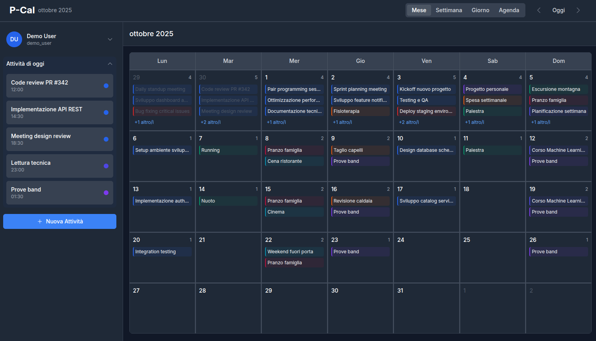
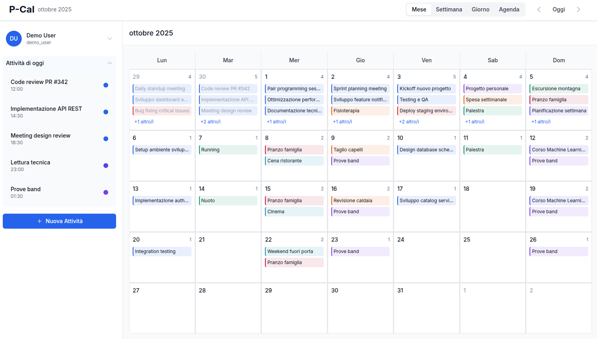
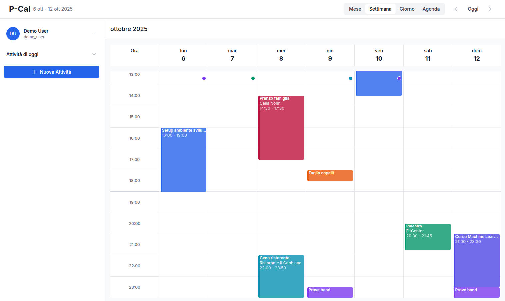
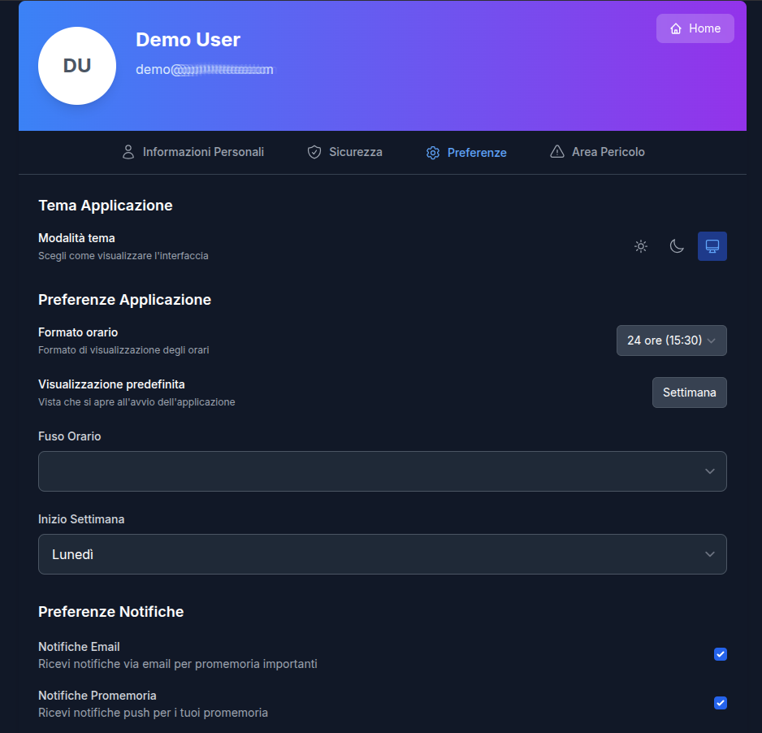
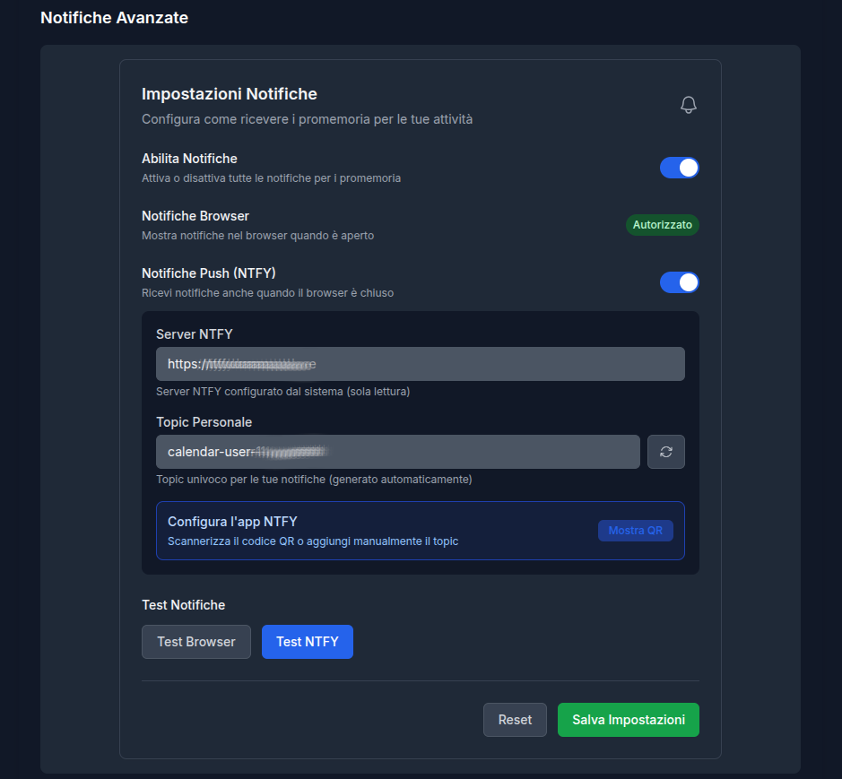

# P-Cal 📅
Read the [English version here](./README.md)

Una semplice e moderna applicazione web di **calendario personale**, con gestione avanzata degli eventi e **reminders programmabili**, con un sistema di **notifiche** multi-canale.

**P-Cal** (Private Calendar) è pensato come un utile calendario self-hostable, moderno e multi-utente, destinato a privati o piccole aziende che vogliono avere il **pieno controllo dei propri dati**.

Il software è **libero e orientato alla privacy**: completamente privo di tracker o raccolta dati, può essere installato sui tuoi server per garantire massima riservatezza.

### ✨ Funzionalità Principali

#### 📊 **Gestione Calendario Completa**
- **Viste multiple**: Mese, Settimana, Giorno e Agenda
- **Gestione eventi/attività** con colori personalizzabili, luogo e descrizioni
- **Visualizzazione temporale intelligente** con distinzione eventi passati/futuri
- **Griglia oraria precisa** nella vista settimanale con indicatori visivi per attività fuori schermo
- **Gestione Eventi Ricorrenti** con pattern customizzabili (RFC 5545, CalDAV compliance)
- **Supporto multilingua completo** (i18n)
- **Tooltips informativi**

#### ⏰ **Sistema di Reminder Avanzato**
- **Notifiche multi-canale** attualmente implementati: Email, Telegram bot e NTFY server
- **Reminder multipli** per ogni attività
- **Scheduling flessibile** (minuti, ore, giorni prima dell'evento)
- **Gestione automatica** delle notifiche scadute

#### 👤 **Gestione Utente e Preferenze**
- **Registrazione e login**
- **Profilo utente** basic info
- **Sezione sicurezza** per modifica password e abilitazione 2FA
- **Export dati completo** (GDPR-friendly)
- **Eliminazione account** con cancellazione dati

#### ⚙️ **Preferenze** (per utente):
- **Tema** (chiaro/scuro/automatico)
- **Lingua** con default da browser 
- **Fuso orario** con ora solare/legale automatica
- **Formato orario** (12h/24h)
- **Primo giorno della settimana** (Lunedì/Domenica)
- **Confugurazione notifiche completa** per tipologia/canale (Email, Telegram, Ntfy)

#### 🎨 **Esperienza Utente**
- **Design responsivo** ottimizzato per desktop e mobile
- **Interfaccia moderna** con Tailwind CSS
- **Tema adattivo** al sistema operativo
- **Performance ottimizzate** con lazy loading
- **Eventi passati** collassabili nelle viste giorno/agenda

#### 🔐 Sicurezza
- **Password hashing** con BCrypt (strength 12)
- **JWT tokens** con scadenza configurabile
- **Input validation** completa lato server
- **CORS protection** configurabile
- **Two-Factor Authentication** TOTP
- **Secure password reset** via email temporizzato
- **Data isolation** per utente (a livello di API)


### 🚀 Quick Start

#### Installazione

```bash
# 1. Clone the repository
git clone https://github.com/FilTer87/P-Cal
cd P-Cal

# 2. Create and configure environment file
cp .env.example .env
nano .env  # Edit .env file with your configuration

# 3. Start the application
docker compose up --build -d

# 4. Access the application
# Frontend: http://localhost
```
- **Frontend**: http://localhost
- **Backend API**: http://localhost:8080/api
- **Swagger UI**: http://localhost:8080/swagger-ui.html
- **Health Check**: http://localhost:8080/actuator/health

### ⚙️ Configurazione

**See [docs/Install.md](docs/Install.md) for complete installation and configuration instructions.


### 🏗️ Architettura

#### Frontend
**TypeScript / Vue.js 3** with Composition API, Pinia, Vite, Tailwind CSS)

#### Backend
**JAVA 17 / Maven / Spring Boot 3.2** with Spring Security, JPA/Hibernate, PostgreSQL, Lombok

#### Infrastructure (Docker compose quick-start)
- **PostgreSQL** custom docker image with automatic migration scripts
- **Nginx image** as internal reverse proxy, also working behind NPM or other proxies for SSL/Https
- **Server NTFY** per notifiche push (esterno al progetto)

#### ⚡ Ottimizzazioni
- **DB indexing**
- **Lazy loading and pagination**
- **Code splitting** with Vite
- **Tree shaking**
- **Caching**


### 🎯 Roadmap Future

#### 🔧 Possibili funzionalità future (nessun ordine specifico)
- **Traduzioni in altre lingue** (attualmente gestite: Inglese, Italiano e Spagnolo)
- **Canali di notifica aggiuntivi**: Discord / Slack / Gotify / ...
- **Categorie eventi** con filtro di visualizzazione globale (alternativa a calendari multipli)
- **Drag & Drop** per spostamento evento/attività nelle griglie ed update automatico
- **Gestione avanzata sessioni utente**
- **Integrazione CalDAV**
- **Import dati** da export utente
- **Import dati** da altri calendar
- **Condivisione eventi** tra gli utenti (gestione inviti)

### 📱 Possibili espansioni
- **API mobile** per app native
- **Calendario condiviso** multi-utente
- **Plugin system** per integrazioni

**NOTA:** *Trattandosi di un progetto personale, il mantenimento e l'implementazione di nuove funzionalità dipenderanno dal tempo libero che ho a disposizione. Sicuramente ricevere una mancia o una donazione è il modo migliore per tenermi sul pezzo!* 🙂

### 📸 Screenshots

#### Desktop
<p>
    
    
    
    
    
    
    
    
    
    
</p>

#### SmartPhone
<p>
   
   
   
   
   
   
</p>

### 📄 Licenza

Questo progetto è rilasciato sotto **[MIT License](./LICENSE)**.


### 📞 Supporto

#### Documentazione
- **Swagger UI**: disponibile in`/swagger-ui.html`
- **OpenAPI JSON**: disponibile in `/v3/api-docs`
- **Code comments**: Javadoc e TSDoc
- **Architecture docs**: Work in progress!

🐛 **Bug reports**: Usa issue template


---


---

**Sviluppato con ❤️ per gestire eventi ed attività da ricordare in modo semplice ed efficace, mantenendo il pieno controllo dei propri dati**